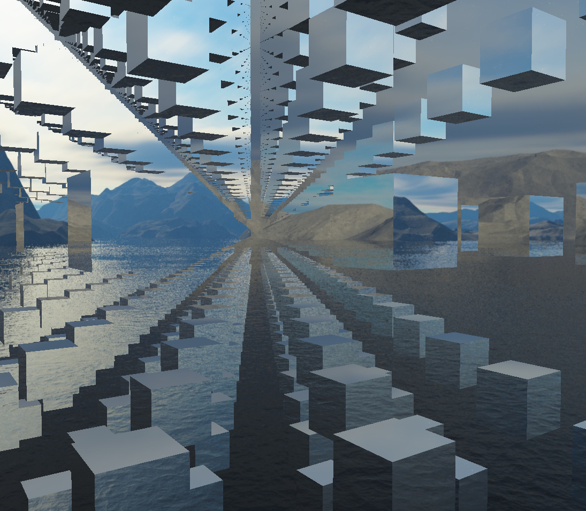

# PowerPit
Graphics rendering engine based on OpenGL.

## Screenshot

## Current features
* Custom math library for vector transformations
* Lights (Phong model)
* Materials, Meshes, Models
* .obj files loading support

## Plans for the future
* Batch rendering
* Fancy lightining (shadows, gamma correction, mapping)
* PBR (whatever the hell that means)
